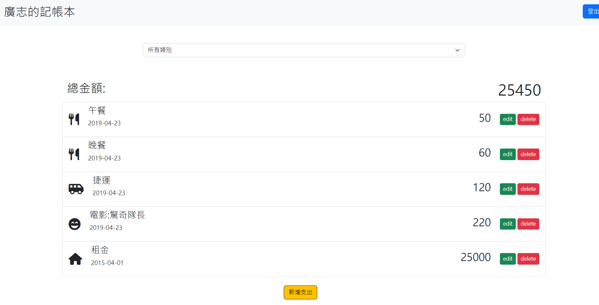

# 我的記帳本



## 介紹

這是一個記帳本，可以讓使用者藉由新增、修改消費紀錄，來追蹤金錢流向。

---

## 功能

- 使用者需註冊會員並登入才能使用記帳本
- 可以觀看全部消費紀錄
- 可以使用分類來查看花費
- 可以新增消費紀錄
- 可以刪除消費紀錄
- 可以修改消費紀錄

---

## 開始使用

1.先確認有安裝 node.js 與 npm

2.開啟終端機(Terminal)，clone 此專案

```bash
git clone https://github.com/Ian920511/expense-tracker.git
```

3.初始化

```bash
cd expense-tracker //進入存放檔案的資料夾
npm install  //安裝插件
```

4.新增 .env 檔，設定環境變數連線 MongoDB ，並根據 .env.example 檔案內資訊設置環境變數

```bash
MONGODB_URI = mongodb+srv://<使用者帳號>:<使用者密碼>@<資料庫伺服器位置>/<資料庫名稱>
```

5.安裝完成後，需新增種子資料，輸入下方程式碼:
(種子帳號為: user1，密碼為: 12345678)

```bash
npm run seed
```

6.完成後，輸入

```bash
npm run dev
```

7.看見此行訊息則代表順利運行

```bash
Sever is running on http://localhost:3000
```

8.進入網頁即可

```bash
http://localhost:3000
```

9.若需要暫停伺服器，則輸入

```bash
ctrl + c
```

---

## 規格

- 程式編輯器: [Visual Studio Code](https://visualstudio.microsoft.com/zh-hant/ "Visual Studio Code")
- 使用框架: [express](https://www.npmjs.com/package/express)@4.16.4
- 模板引擎: [express-handlebars](https://www.npmjs.com/package/express-handlebars)@3.0.0
- 資料庫: [MongoDB]
- 編程資料庫: [Mongoose](https://mongoosejs.com/)@5.9.7
- 環境變數: [dotenv](https://www.npmjs.com/package/dotenv)@16.0.3
- 重構程式碼: [method-override](https://www.npmjs.com/package/method-override)@3.0.0
- 使用者認證: [passport](https://www.npmjs.com/package/passport)@0.4.1
- 使用者認證: [passport-local](https://www.npmjs.com/package/passport-local)@1.0.0
- 時間格式處理: [dayjs](https://www.npmjs.com/package/dayjs)
- 密碼加密: [bcryptjs](https://www.npmjs.com/package/bcryptjs)@2.4.3
